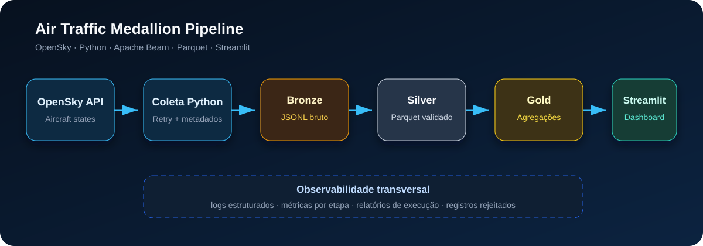

# Brazil Air Traffic Beam

[](https://github.com/Lal3x/air-traffic-medallion-pipeline/actions/workflows/ci.yml)


Pipeline local de tráfego aéreo na região de São Paulo, com coleta OpenSky, Apache Beam e arquitetura medalhão. O projeto transforma respostas da API em dados analíticos, mantém artefatos por execução e apresenta os resultados em um dashboard Streamlit.

## Arquitetura



```text
OpenSky → Coletor Python → Bronze (JSONL)
                              ↓ Apache Beam
                         Silver (Parquet) + Rejeitados (JSONL)
                              ↓ Apache Beam
                         Gold (JSONL) → Streamlit
```

- **Bronze:** um arquivo por coleta, com um envelope por resposta e metadados de ingestão.
- **Silver:** observações normalizadas e validadas, com coordenadas, velocidade e último contato.
- **Gold:** última observação por `icao24` e resumo de todas as observações da carga.
- **Observabilidade:** relatórios JSON por etapa e logs técnicos da execução completa.

Os pipelines usam `DirectRunner` localmente. `make stream` repete lotes finitos; não há um pipeline de streaming ilimitado configurado.

## Decisões de arquitetura

- **Execução local e reproduzível:** o DirectRunner permite estudar e validar os pipelines sem depender de infraestrutura em nuvem.
- **Camadas imutáveis por execução:** UUIDs e partições temporais preservam o histórico e facilitam auditoria e reprocessamento.
- **Parquet na Silver:** formato colunar reduz leitura desnecessária e facilita consultas analíticas com DuckDB.
- **Registros rejeitados separados:** dados inválidos não interrompem o pipeline e permanecem disponíveis para diagnóstico.
- **Observabilidade como parte do fluxo:** cada etapa produz métricas, relatórios e logs, em vez de tratar monitoramento como recurso posterior.
- **Dashboard desacoplado:** o Streamlit consome os artefatos Gold sem iniciar ou controlar a coleta.

## Começar

Requisitos: Python 3.13, Poetry e Git. Os exemplos de shell usam Bash; os atalhos `make` exigem Make.

```bash
git clone https://github.com/Lal3x/air-traffic-medallion-pipeline.git
cd air-traffic-medallion-pipeline
poetry env use python3.13
poetry install --with dev
cp .env.example .env
poetry run python -m air_traffic_beam.run_all --max-collections 1 --interval-seconds 1
```

Se já possui o clone e o `.env`, use os arquivos existentes. Em outro terminal, na raiz do projeto:

```bash
poetry run streamlit run src/air_traffic_beam/dashboard/app.py
```

Abra o endereço exibido pelo Streamlit, normalmente `http://localhost:8501`. Use **Atualizar dados** depois de uma nova carga. O painel lê arquivos locais e não inicia a coleta.

## Configuração da coleta

O cliente consulta `/states/all` sem enviar credenciais. A região padrão é:

| Limite | Valor |
| --- | --- |
| Latitude mínima | -24.2 |
| Longitude mínima | -47.2 |
| Latitude máxima | -22.7 |
| Longitude máxima | -45.5 |

Para alterar região, quantidade, intervalo ou destino Bronze, use `--lat-min`, `--lon-min`, `--lat-max`, `--lon-max`, `--max-collections`, `--interval-seconds` e `--output`.

Embora `Settings` leia `.env`, a CLI passa valores explícitos que prevalecem sobre ele. URL e timeout são lidos pelo coletor de variáveis exportadas no processo. Veja a [configuração detalhada](docs/setup.md) antes de alterar esses parâmetros.

O cliente converte `states: null` em `[]` antes de gravar Bronze. Timeouts, falhas de conexão e HTTP 5xx permitem até três tentativas; HTTP 429 interrompe a coleta sem repetição automática. A mensagem de erro inclui o tempo de espera informado pela API quando disponível.

## Execução e reprocessamento

`make run` executa uma carga completa. O orquestrador passa entre as etapas somente os arquivos recém-produzidos.

Para executar cada etapa isoladamente:

```bash
make collect
make bronze-to-silver
make silver-to-gold
```

**As etapas isoladas leem o histórico por padrão.** Reprocessar a mesma Bronze gera novos Parquets Silver; agregá-los com os anteriores pode contar observações repetidas. Use `--input` para selecionar a carga desejada ou prefira `make run`.

Para repetir cargas:

```bash
make stream
```

O padrão é de 15 coletas por ciclo, um segundo entre requisições e espera de 300 segundos após o processamento. Para alterar:

```bash
make stream STREAM_MAX_COLLECTIONS=3 STREAM_COLLECTION_INTERVAL_SECONDS=60 STREAM_INTERVAL_SECONDS=300
```

`Ctrl+C` interrompe o loop; uma falha também encerra a execução. Mais detalhes no [guia de execução](docs/running.md).

## Artefatos e diagnóstico

| Diretório | Conteúdo |
| --- | --- |
| `data/bronze/aircraft_states/` | Microbatches JSONL particionados por data e hora de ingestão |
| `data/silver/aircraft_states/` | Observações válidas em Parquet |
| `data/rejected/aircraft_states/` | Rejeições com motivo em JSONL |
| `data/gold/latest/` | Última observação por aeronave, em JSONL |
| `data/gold/traffic/` | Resumo das observações, em JSONL |
| `data/observability/` | Relatórios JSON e subdiretório `logs/` |

Os prefixos com UUID preservam as saídas anteriores. O resumo `traffic` usa todas as observações, enquanto `latest` seleciona uma por aeronave; contagens em voo/no solo no resumo podem incluir a mesma aeronave várias vezes.

A execução completa grava `data/observability/logs/pipeline.log`, com rotação de 5 MB e três backups. Para exibir também INFO de Beam/Prism no terminal:

```bash
poetry run python -m air_traffic_beam.run_all --verbose
```

Consulte o [dicionário de dados](docs/data_dictionary.md) e o [contrato dos relatórios](docs/reports.md), incluindo as unidades das contagens e as limitações de registro de falhas.

## Limitações e evolução para produção

Este repositório representa uma implementação local e educacional. Para uma operação contínua em produção, os próximos passos seriam:

- substituir o loop de microbatches por ingestão realmente contínua e adicionar janelas, triggers e watermarks;
- executar o Beam em um runner distribuído, como Google Cloud Dataflow, Flink ou Spark;
- armazenar Bronze, Silver e Gold em object storage, com catálogo e políticas de retenção;
- adicionar idempotência por carga e controle explícito de dados atrasados;
- publicar métricas em uma plataforma de monitoramento e configurar alertas;
- disponibilizar o dashboard como serviço, com autenticação e atualização controlada.

## Qualidade e desenvolvimento

```bash
poetry check
poetry run task check
poetry run task docs
```

| Comando | Função |
| --- | --- |
| `poetry run task lint` | Verificar código, imports e formatação com Ruff |
| `poetry run task format` | Organizar imports e formatar |
| `poetry run task types` | Executar Mypy |
| `poetry run task tests` | Executar testes, mostrar linhas não cobertas e gerar `coverage.xml` |
| `poetry run task check` | Executar lint, tipos e testes |
| `poetry run task docs` | Gerar documentação com `mkdocs build --strict` |

`task test` é um alias de `task tests`. Os testes exigem cobertura mínima de **70%** do pacote `air_traffic_beam`. Para ativar os hooks em cada clone:

```bash
poetry run pre-commit install
poetry run pre-commit run --all-files
```

O pre-commit verifica código, formatação, YAML/TOML, conflitos e espaços em branco, e executa os testes com cobertura. Se corrigir arquivos, revise e adicione as alterações novamente antes do commit.

## Documentação e GitHub Pages

Para visualizar a documentação localmente:

```bash
poetry run mkdocs serve
```

Abra `http://127.0.0.1:8000`. O build estático fica em `site/`, ignorado pelo Git e pelo Docker.

O workflow `CI` executa verificações em pull requests e pushes para `main` ou `master`. Publica a documentação somente em execuções da branch padrão, após todas as verificações passarem. Também pode ser iniciado manualmente pela aba **Actions**.

Configure **Settings → Pages → Build and deployment → Source → GitHub Actions** no repositório. O workflow usa `GITHUB_TOKEN`, sem token pessoal. Endereço configurado: [documentação no GitHub Pages](https://lal3x.github.io/air-traffic-medallion-pipeline/).

## Guias

- [Instalação e configuração](docs/setup.md)
- [Arquitetura](docs/architecture.md)
- [Execução local](docs/running.md)
- [Dashboard](docs/dashboard.md)
- [Walkthrough do projeto](docs/project_walkthrough.md)
- [Apache Beam explicado](docs/apache_beam_explained.md)
- [Dúvidas e diagnóstico](docs/faq.md)

O código fica em `src/air_traffic_beam/`, os testes em `tests/` e a documentação em `docs/`.
