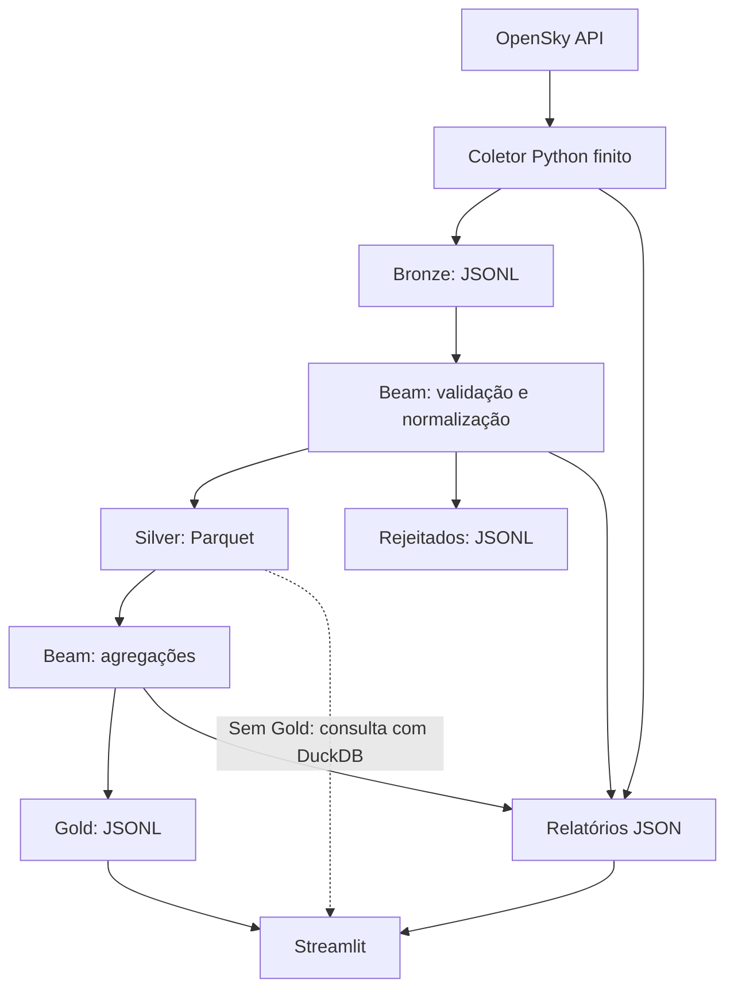

# Arquitetura

## Responsabilidades

| Componente | Responsabilidade |
| --- | --- |
| `collectors/opensky_client.py` | Consultar a API, validar respostas e repetir falhas transitórias |
| `collectors/aircraft_states.py` | Acumular respostas de uma execução e gravar um microbatch Bronze atomicamente |
| `pipelines/bronze_to_silver.py` | Executar parsing, normalização e separação de rejeitados com Beam |
| `pipelines/silver_to_gold.py` | Produzir a última observação por aeronave e o resumo das observações de entrada |
| `run_all.py` | Encadear as etapas usando os arquivos produzidos na execução atual |
| `dashboard/app.py` | Ler Gold e relatórios; consultar Silver com DuckDB quando Gold não existe |

Os módulos acima ficam em `src/air_traffic_beam/`. O coletor é Python comum; os dois pipelines de transformação usam Apache Beam com `DirectRunner` nos comandos documentados.

## Persistência e escopo

A Bronze acumula as respostas em memória e grava um arquivo ao terminar a coleta. Se uma requisição falhar depois de respostas válidas, grava o lote parcial com sufixo `_partial.jsonl` antes de propagar o erro.

Silver e Gold recebem UUIDs nos prefixos de saída. Isso preserva os arquivos anteriores, mas não torna reprocessamentos idempotentes: ler novamente a mesma Bronze gera novas observações Silver. Consulte [Execução local](running.md) para escolher entre a carga atual e o histórico.

O resumo Gold usa `ToList` e mantém as observações de entrada em memória. A implementação atende a lotes locais pequenos; o loop `make stream` repete execuções finitas, sem janelas ou estado persistente de streaming.
