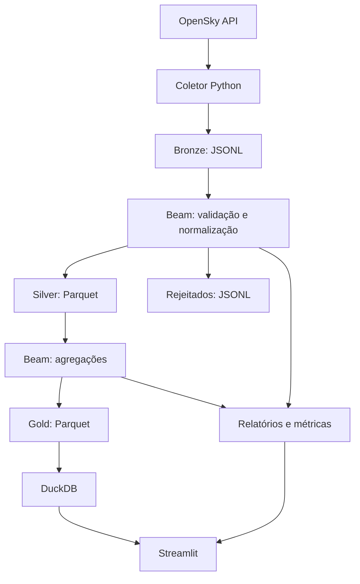

# Arquitetura

A coleta usa `DirectRunner` localmente e salva cada resposta em Bronze imediatamente. O pipeline de transformação normaliza os state vectors e separa registros inválidos. O dashboard lê apenas os arquivos relevantes com DuckDB, aplicando filtros e limites antes de converter para pandas.
