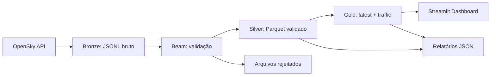

# Fluxo de dados

## Visão geral

O projeto organiza os dados em camadas lógicas para manter clareza entre coleta, validação e consumo analítico.

## Bronze

A camada Bronze guarda um arquivo por execução, com uma linha por resposta. Cada envelope contém o payload validado pelo cliente e metadados de ingestão; `states: null` é convertido em lista vazia antes da gravação.

## Silver

A camada Silver converte cada vetor do OpenSky em um esquema estável e útil para análise. Essa etapa também separa os registros inválidos, preservando a qualidade dos dados.

## Gold

A camada Gold contém duas visões:

- `latest`: snapshot mais recente por aeronave;
- `traffic`: agregações sobre todas as observações dos arquivos de entrada, sem janelas temporais Beam.

## Rejeitados

Aplicações reais precisam preservar dados problemáticos para auditoria. A etapa de rejeição garante que uma linha ruim não se perca sem contexto.

## Observabilidade

Cada etapa registra métricas e status em arquivos JSON para permitir rastreio de execução, debugging e produção de relatórios.
