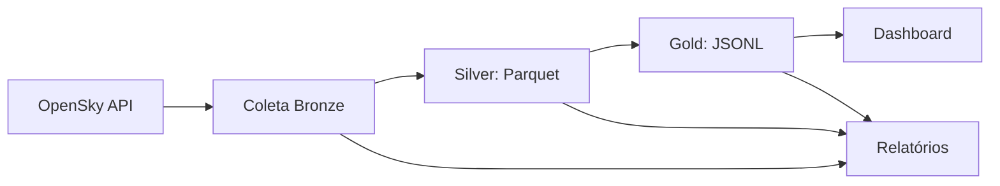

    
PORTFÓLIO DE ENGENHARIA DE DADOS • APACHE BEAM

    <h1>Brazil Air <em>Traffic Beam</em></h1>
    
Um laboratório local de dados para transformar sinais de tráfego aéreo em uma história rastreável: coletar, validar, agregar e explicar.

    

        <a class="md-button md-button--primary" href="setup/">Começar pelo setup</a>
        <a class="md-button" href="architecture/">Ver arquitetura</a>
    

    
<strong>01</strong>API pública OpenSky

    
<strong>02</strong>Medallion Bronze → Gold

    
<strong>03</strong>Execução local observável

## O projeto em uma leitura

Este projeto implementa um fluxo medallion em Python com:

- coleta da OpenSky Network em Bronze,
- validação e normalização em Silver,
- agregações e snapshot em Gold,
- observabilidade com relatórios JSON e logs técnicos,
- dashboard interativo em Streamlit.

## A ideia central

O principal objetivo é demonstrar, de forma didática, como um pipeline de dados pode ser estruturado com Apache Beam em um ambiente local, usando dados reais da API pública da OpenSky e preservando um histórico operacional sem sobrescrever resultados anteriores.

## Stack principal

- Python 3.13
- Apache Beam (DirectRunner)
- PyArrow
- DuckDB
- Streamlit
- Pydantic Settings
- Tenacity
- MkDocs + Material

## Fluxo principal

## Roteiro de estudo

1. [Prepare o ambiente](setup.md) e entenda as configurações locais.
2. [Execute a coleta](collection.md) e observe um microbatch Bronze.
3. [Siga a transformação Bronze → Silver](bronze_to_silver.md).
4. [Explore o Gold e o dashboard](silver_to_gold.md).
5. [Leia o walkthrough de Beam](project_walkthrough.md) para conectar código e conceitos.

## Documentação relacionada

- [Arquitetura](architecture.md)
- [Fluxo de dados](data_flow.md)
- [Guia de execução](setup.md)
- [Apache Beam explicado](apache_beam_explained.md)

!!! tip "Uma boa primeira exploração"
    Rode uma execução pequena, abra os arquivos em `data/` e compare o payload bruto da Bronze com o registro normalizado da Silver. A arquitetura fica mais clara quando você acompanha a mesma aeronave pelas três camadas.
