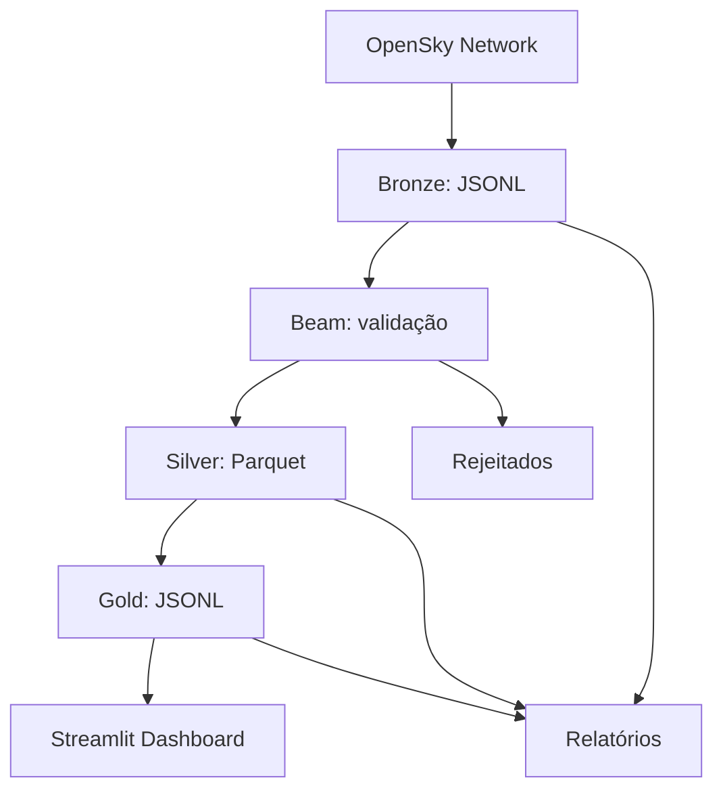

# Introdução

Este projeto foi pensado como uma referência didática para pipelines de dados locais com Apache Beam, usando uma API pública de monitoramento aéreo.

A camada Bronze armazena respostas da OpenSky Network em envelopes; o cliente converte `states: null` em lista vazia. A camada Silver converte cada vetor posicional em um registro estruturado, validado e pronto para análise. A camada Gold agrega a visão mais recente por aeronave e também gera um resumo do tráfego.

## Principais características

- coleta pública e sem autenticação para a OpenSky Network;
- estratégia de microbatch por execução local;
- arquivos sendo persistidos por execução, sem apagar históricos;
- biblioteca de observabilidade com JSON de execução e logs técnicos;
- dashboard para verificar o tráfego aéreo observado;
- organização clara de pastas para Bronze, Silver, Gold e observabilidade.

## Regras de negócio

- Os epochs da fonte são preservados; datas operacionais e `last_contact_at` usam o fuso de São Paulo.
- Cada execução gera identidades únicas para rastreio de histórico.
- Registros inválidos são guardados em rejeitados para auditoria.
- Dados Gold são separados em `latest` e `traffic`.

## Arquitetura em resumo

