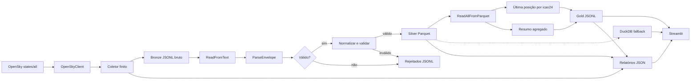

# Walkthrough do projeto

Este documento acompanha uma execução local de ponta a ponta. O projeto usa a API pública da OpenSky, Apache Beam com DirectRunner, arquivos locais e arquitetura medalhão.

## Visão geral



## 1. Como `make run` começa

O alvo `run` chama:

```bash
poetry run python -m air_traffic_beam.run_all --max-collections 1 --interval-seconds 1
```

`run_all.main()` configura o logging e executa três fases em sequência. Depois de cada fase, ele lê o relatório JSON recém-gravado, imprime contagens reais e só inicia a próxima fase se a anterior terminar com sucesso.

O alvo `stream` repete esse fluxo em micro-batches. Ele não transforma o DirectRunner em um serviço Beam infinito: apenas inicia uma nova execução local depois do intervalo configurado.

## 2. Consulta à OpenSky

`collectors/opensky_client.py` usa `requests.Session` para chamar:

```text
GET https://opensky-network.org/api/states/all
```

Os parâmetros `lamin`, `lomin`, `lamax` e `lomax` representam a caixa geográfica de São Paulo. Timeout, conexão e HTTP 5xx podem ser repetidos pelo Tenacity. HTTP 429 gera um erro específico, porque repetir imediatamente poderia piorar o limite da API.

O cliente valida que a resposta é um objeto JSON, que possui `time` e que `states` é uma lista ou `null`. `null` é convertido para lista vazia, sem inventar aeronaves.

## 3. Bronze: resposta bruta envelopada

`collectors/aircraft_states.py` adiciona metadados de ingestão à resposta validada pelo cliente. A escrita é atômica: o arquivo temporário só é renomeado quando todas as linhas do microbatch foram gravadas.

Exemplo reduzido:

```json
{"_metadata":{"source":"opensky_network","execution_id":"exec-123","collection_number":1},"payload":{"time":1789358815,"states":[["e8045f","LAN756  ","Chile",1789358814,1789358815,-46.6499,-23.461,1417.32,false,101.59,123.85,-9.1,null,1524,null,false,0]]}}
```

A Bronze é raw: ela não renomeia campos posicionais nem descarta o payload para facilitar auditoria e reprocessamento.

## 4. Como o Beam lê a Bronze

Em `pipelines/bronze_to_silver.py`, `beam.Pipeline` recebe `PipelineOptions`. O `ReadFromText` cria a PCollection `lines`, uma coleção distribuída de linhas JSONL.

O Beam constrói o grafo antes de executá-lo. As transformações são nomeadas para aparecerem no runner e no log:

```python
lines = pipeline | "Ler arquivos Bronze" >> beam.io.ReadFromText(input_path)
parsed = lines | "Validar envelopes" >> beam.ParDo(ParseEnvelope())
```

A PCollection é processada pelo Beam em elementos e bundles. Por isso o pipeline não precisa fazer `read_text()` de todos os envelopes antes do processamento. A contagem posterior usa metadata Parquet ou linhas JSONL somente para produzir métricas do artefato concluído.

## 5. Como `states` vira aeronave Silver

A OpenSky retorna cada aeronave como um array posicional. `STATE_INDEXES` documenta o contrato:

```text
0  icao24             identificador
1  callsign           indicativo
2  origin_country     país
3  time_position      posição em epoch
4  last_contact       contato em epoch
5  longitude          longitude
6  latitude           latitude
7  baro_altitude      altitude barométrica em metros
8  on_ground          situação no solo
9  velocity           velocidade em m/s
10 true_track         proa em graus
11 vertical_rate      razão vertical em m/s
12 sensors            sensores
13 geo_altitude       altitude geométrica em metros
14 squawk             código transponder
15 spi                indicador especial
16 position_source    origem da posição
17 category           categoria opcional
```

`normalize_state_vector()` usa esses índices, valida coordenadas, remove espaços nas extremidades do callsign, converte velocidade de m/s para km/h e cria `last_contact_at` como `datetime` tipado no fuso `America/Sao_Paulo`. `last_contact` continua preservado como epoch original.

Exemplo Silver:

```json
{"icao24":"e8045f","callsign":"LAN756","origin_country":"Chile","longitude":-46.6499,"latitude":-23.461,"velocity_mps":101.59,"velocity_kmh":365.724,"barometric_altitude_m":1417.32,"on_ground":false,"last_contact":1789358815,"last_contact_at":"2026-09-14T01:06:55-03:00"}
```

## 6. Válidos e rejeitados

`ParseEnvelope` é um `DoFn`. Para cada linha, ele pode emitir:

- saída principal `valid`, quando o envelope e os state vectors podem continuar;
- tagged output `rejected`, quando há JSON inválido, envelope inválido ou vetor curto.

`ValidateAndNormalizeAircraftState` repete a validação de campos críticos antes da gravação. Os dois fluxos de rejeitados são unidos por `Flatten` e serializados em JSONL. Assim, um registro ruim não interrompe necessariamente o lote inteiro e seu motivo pode ser auditado.

## 7. Silver

A saída válida é gravada em Parquet usando `WriteToParquet` e `SILVER_AIRCRAFT_SCHEMA`. O schema fixa tipos analíticos, incluindo timestamp com fuso `America/Sao_Paulo`, números e booleanos. O prefixo recebe UUID de execução, portanto uma nova execução não apaga as anteriores.

O relatório `bronze_to_silver-<uuid>.json` registra arquivos, entradas, válidos, rejeitados, taxa de erro e caminhos produzidos. Quando não há válidos ou rejeitados, a etapa registra essa situação explicitamente.

## 8. Gold

`pipelines/silver_to_gold.py` descobre os Parquets da execução e usa `ReadAllFromParquet`. A PCollection de registros alimenta duas ramificações:

1. `Map` cria pares `(icao24, registro)`.
2. `GroupByKey` reúne observações da mesma aeronave.
3. `_latest_by_aircraft` escolhe o maior `last_contact`.
4. `ToList` e `Map(_summary)` calculam observações, aeronaves únicas, situação no solo, velocidade e altitude médias.
5. `WriteToText` grava as duas visões JSONL.

Exemplo de posição Gold:

```json
{"icao24":"e8045f","callsign":"LAN756","latitude":-23.461,"longitude":-46.6499,"last_contact_at":"2026-09-14 01:06:55-03:00"}
```

Exemplo de resumo Gold:

```json
{"aircraft_observations":12,"unique_aircraft":6,"airborne_aircraft":12,"on_ground_aircraft":0,"average_velocity_kmh":502.548,"latest_contact":1789358830}
```

## 9. DuckDB e Streamlit

O Streamlit prefere o snapshot Gold mais recente. Se Gold ainda não existir, `dashboard/app.py` usa DuckDB para consultar Parquets Silver como fallback:

```sql
SELECT *
FROM read_parquet(?)
WHERE latitude IS NOT NULL AND longitude IS NOT NULL
LIMIT ?
```

A UI apresenta mapa, filtros, tabela de aeronaves e uma aba de qualidade. A aba de qualidade lê os relatórios JSON, mostra saúde por etapa, duração, rejeições, histórico e detalhes técnicos sob demanda.

## 10. Logs e relatórios

`logging_config.py` instala dois handlers:

- terminal: INFO do pacote `air_traffic_beam` e somente ERROR de Beam/Prism;
- arquivo: INFO técnico completo em `data/observability/logs/pipeline.log`, com rotação de 5 MB e três backups.

Cada estágio concluído escreve um relatório JSON em `data/observability/`; falhas anteriores à gravação podem não gerar relatório, conforme [Logs e relatórios](reports.md). Esses relatórios são a fonte das métricas mostradas no terminal pelo `run_all`; não são números calculados a partir de todo o histórico.

Use `--verbose` para exibir INFO do Beam no terminal:

```bash
poetry run python -m air_traffic_beam.run_all --verbose
```
